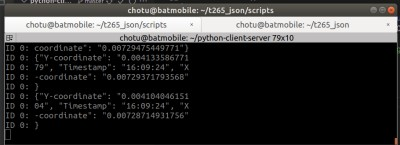

## What this script will do ?

This script will fetech the Odometry data from a ROS topic and publish it as a JSON file over  Socket communication .

##CLONE THE REPO

	git clone https://github.com/chrissunny94/t265_json

## Pre Requisites .

Install ROS , 

* http://wiki.ros.org/ROS/Installation , for laptop/desktop , use this
* https://downloads.ubiquityrobotics.com/pi.html ,for raspberry Pi , use this .(*This comes preinstalled with ROS *)
	* Tested on 2GB and 4GB variant 
	

#### Install Realsense Drivers

	sudo apt install ros-$ROS_DISTRO-realsense2-camera  ros-$ROS_DISTRO-librealsense2
	
	# in my case it was
	
	sudo apt install ros-melodic-realsense2-camera ros-melodic-librealsense2
	
	

#### Running the realsense ROS drivers

	roslaunch realsense2_camera demo_t265.launch
	

## Instructions

* Run the python script for **subscribing to ROS topic from T265 sensor**  	   	
	
	
		python scripts/t265_ROS_topic_to_JSON.py		
  
  
    
   
  
  it will end up  **publishing the following contents in JSON**
   
   
   		{"Timestamp": "08:44:25", 
   		"X": "0.0062", 
   		"Y": "0.002}

   
    
   

## All the following is for debug purposes only . 

#### If you want  to run the server locally to echo out the JSON messages  and test , then  run the following
  
* Run http server for viewing JSON messages

		python3 scripts/server.py
	
		
  	
   		

### Additional Info 

*click on the video link below*

We have attached a bagfile of what data the realsense sensor will put out when interfaced over ROS . 

* Run bag file 
		
	
		rosbag play bagfile/2020-09-25-17-29-33.bag -l

If you type 

	 rostopic list

Then you will see this .

	/camera/accel/imu_info
	/camera/accel/sample
	/camera/gyro/imu_info
	/camera/gyro/sample	
	/camera/odom/sample
	/camera/realsense2_camera_manager/bond
	/camera/tracking_module/parameter_descriptions
	/camera/tracking_module/parameter_updates
	/clock
	/diagnostics
	/rosout
	/rosout_agg
	/tf
	/tf_static

Of which , this is the topic of  our interest . This is what we are currently *fetching*  **from ROS** and *sending*  **out as JSON** .

	/camera/odom/sample
	

Thie following command will give the information about the topic 

	
	 rostopic info /camera/odom/sample 
	

It will tell you that the message is of 

* Type: nav_msgs/Odometry [http://docs.ros.org/melodic/api/nav_msgs/html/msg/Odometry.html](http://docs.ros.org/melodic/api/nav_msgs/html/msg/Odometry.html)  
	
