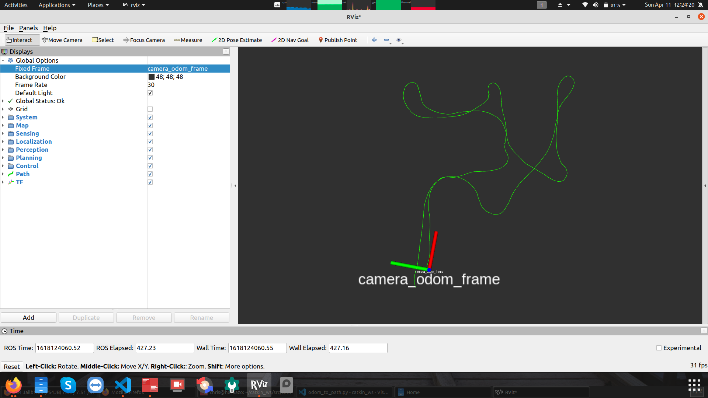

# t265_json




Requirement ,

UBUNTU LTS version and the correct ROS version  

**This is the result of 6 months of misery at the end where i gained nothing other than wated time and effort . Hope you dont waste time on this hope your efforts are atelast fruitful**

No Best Regards ,

- Dil , trinath 

And the rest .


- 14.04 = ROS indigo 
- 16.04 = ROS Kinetic
- 18.04 = ROS Melodic
- 20.04 = ROS Noetic


Please install git 

```
sudo apt install git 
sudo pip3 install python-socketio eventlet
```


## Clone & install ros

```
mkdir ~/catkin_ws/src -p
cd ~/catkin_ws/src
git clone  https://github.com/chrissunny94/t265_json
cd t265_json
```


## Install the dependencies 


```
./install_ros_melodic_and_realsense_drivers_for_ubuntu.sh
```


## Build the workspace (build using catkin) 


```
cd ../../
catkin build
source devel/setup.bash
```


## How to use

The following will launch 3 things ,

- Real sense camera drivers

- Python script to interact with ANdroid APP

- Python script to interact with REALSENSE and ANdroid APP


```
cd ~/catkin_ws
source devel/setup.bash
roslaunch t265_json demo_t265.launch

```


## How to test without hardware 


```
roslaunch t265_json demo_t265_with_prerecordeddata.launch
```


## Screenshots of a suitable APK


