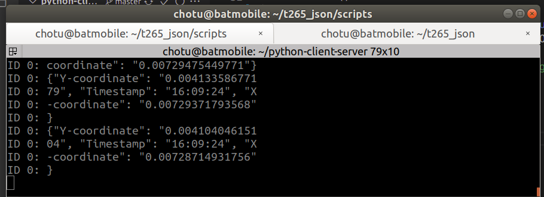

## Instructions
* Run bag file 
		
		rosbag play bagfile/2020-09-25-17-29-33.bag -l

* Run http server for viewing JSON messages

		python3 scripts/server.py
	
		# use python3 command here
   	*only for debug*
   	
  * Run the python script for capturing ROS topic from T265 sensor and publishing the following contents in JSON
  
     
    
   	* X/Latitude
   	* Y/Longitude
   	* Timestamp
   	
   			python scripts/listener.py		
   		